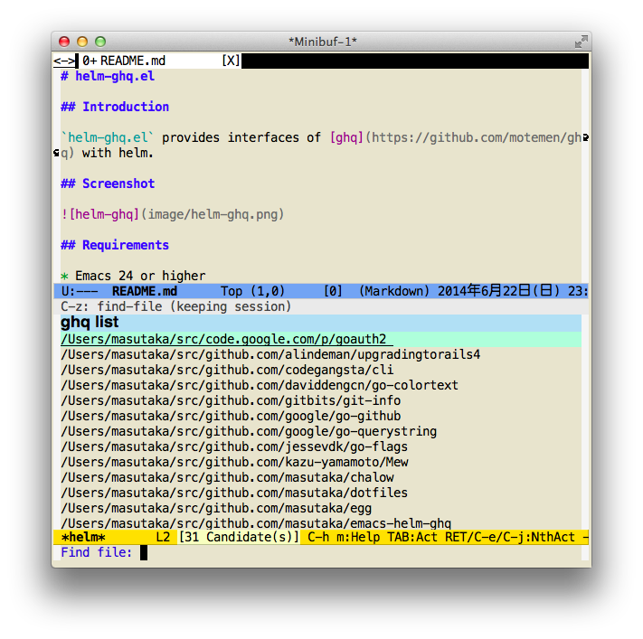

# helm-ghq.el

## Introduction

`helm-ghq.el` provides interfaces of [ghq](https://github.com/motemen/ghq) with helm.

## Screenshot



## Requirements

* Emacs 24 or higher
* helm 1.6.2 or higher
* [ghq](https://github.com/motemen/ghq) 0.3 or higher.

## Installation

You can install `helm-ghq.el` from [MELPA](https://github.com/milkypostman/melpa.git) with package.el (`M-x package-install helm-ghq`).

## Usage

### `helm-ghq`

Execute with `ghq list --full-path` command. You can select a
directory from the results.

### `helm-for-files`

Require the following configuration.

```lisp
(add-to-list 'helm-for-files-preferred-list 'helm-source-ghq)
```
